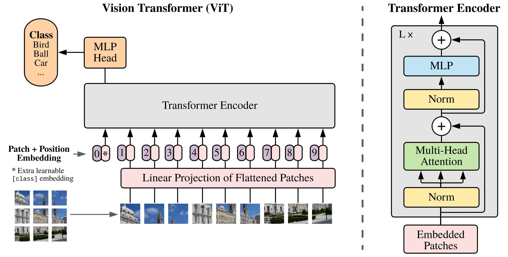

# Vision Transformer (ViT) Implementation

This repository provides a clean, modular implementation of the Vision Transformer (ViT) architecture, designed to be flexible and easily modifiable. The code replicates the basic ViT model as described in the original paper:<br>
["An Image is Worth 16x16 Words: Transformers for Image Recognition at Scale"](https://arxiv.org/abs/2010.11929).



## Overview

This implementation includes the following key components:
- **Patch Embedding**: Converts input images into fixed-size patches using a convolutional layer, then adds the [CLS] token and position embeddings.

- **Transformer Encoder Block**: The core block combining Multi-Head Self-Attention (MSA) and MLP layers.

- **ViT Model**: The complete Vision Transformer model with configurable depth, width, and other parameters.

## Features

- **Modular design**: All components (patch embedding, transformer blocks) are modular and reusable.

- **Configurable architecture**: Easily adjust the number of layers, embedding dimensions, and heads in the transformer.

- **Pre-LayerNorm architecture**: Follows the ViT paper design, which uses pre-LayerNorm for better stability in training.

## Usage

1. **Requirements**<br>
   Install the required dependencies using `pip`:
   
   ```bash
   pip install -r requirements.txt
   ```
   
   Note: PyTorch requires Python 3.10 or later. The exact PyTorch version to install depends on your computing platform (CPU/GPU, CUDA version, operating system).
   For more information, see:<br>
   https://pytorch.org/get-started/locally/

2. **Model Initialization**<br>
   To initialize a ViT model, simply call:
   ```python
   from vit import ViT
   ```

## Example: ViT-Base model

Instantiate the model with 12 layers, 768 embedding dimension:

   ```python
   model = ViT(image_size=224,patch_size=16, embedding_dim=768, num_heads=12, num_layers=12, num_classes=1000)
   ```

You can inspect the model architecture with model summary:

```python
from torchinfo import summary

summary(model=model, input_size=(1, 3, 224, 224),
        col_names=["input_size", "output_size", "num_params", "trainable"],
        col_width=20,
        row_settings=["var_names"])
```
